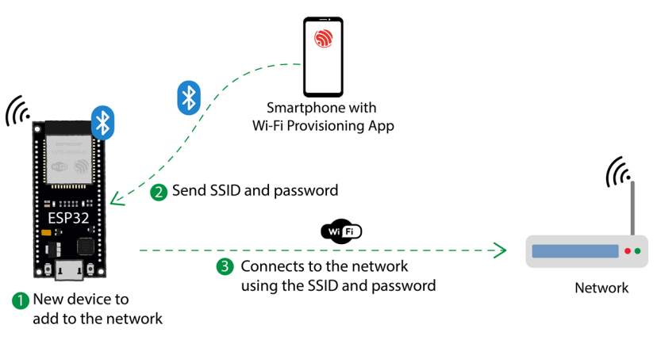
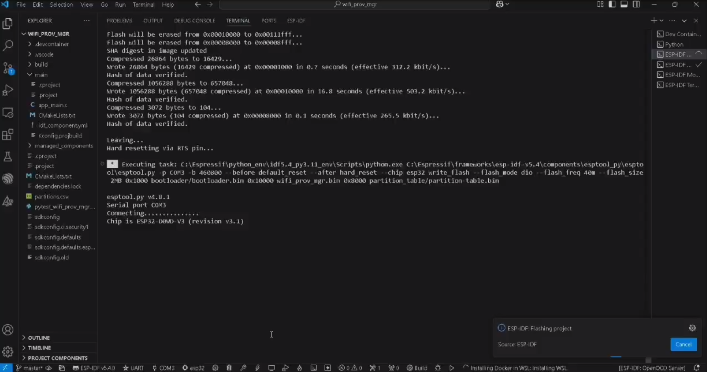

# Overview
Advanced Wi-Fi configuration solution for ESP32/ESP32-S2 devices using secure, flexible provisioning mechanisms.
## Key Features

    Transport Methods:
    Bluetooth Low Energy (BLE)
    Soft Access Point (SoftAP)
    Secure Credential Transfer
    Multi-Platform Support
    Custom Data Endpoint

## Supported Platforms

    Android
    iOS
    Linux
    Windows
    macOS

## Components

    wifi_provisioning: Wi-Fi configuration management
    protocomm: Secure communication protocol
    protobuf: Data serialization
    bt: ESP32 Bluetooth stack

## Hardware Requirements

    ESP32/ESP32-S2 Development Board
    USB Cable
    Smartphone/Computer

## Configuration Options

    NimBLE/Bluedroid Host Selection
    BLE/SoftAP Transport
    Link Encryption

## Application Required
Provisioning applications are available for various platforms. See below

### Platform : Android
For Android, a provisioning application along with source code is available on GitHub : [esp-idf-provisioning-android](https://github.com/espressif/esp-idf-provisioning-android)

### Platform : iOS
For iOS, a provisioning application along with source code is available on GitHub : [esp-idf-provisioning-ios](https://github.com/espressif/esp-idf-provisioning-ios)

### Platform : Linux / Windows / macOS
To install the dependency packages needed, please refer to the [README file](https://github.com/espressif/esp-idf/blob/master/examples/README.md#running-test-python-script-pytest).

esp_prov supports BLE and SoftAP transport for Linux, MacOS and Windows platforms. For BLE, however, if dependencies are not met, the script falls back to console mode and requires another application through which the communication can take place. The esp_prov console will guide you through the provisioning process of locating the correct BLE GATT services and characteristics, the values to write, and input read values.


# Configuring and Building the Project

## Configure the Project
1. Open the project configuration menu by running:
   ```bash
   idf.py menuconfig
   ```
2.  Navigate to "Example Configuration" options and set the BLE/Soft AP transport:
        ESP32-S2 Note: Only the SoftAP option is available (SoftAP cannot be used if IPv4 is disabled in lwIP).

Build and Flash the Project

1.  Build the project, flash it to the board, and start the serial monitor with the following command:
2.  ```bash
       idf.py -p PORT flash monitor
       ```

  Replace PORT with the appropriate serial port of your device.

3. To exit the serial monitor, type Ctrl-].

For detailed steps on configuring and using ESP-IDF to build projects, refer to the Getting Started Guide.

## Provisioning Workflow

1. Device Broadcasts Service
2. Client Connects
3. Secure Credential Exchange
4. Wi-Fi Network Configuration
5. Automatic Connection



## Serial Logs
Click on the following to watch the video.
[](esp_logs.mp4)
